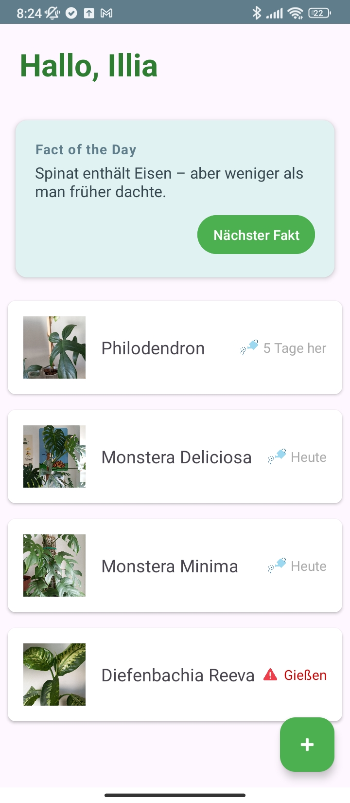
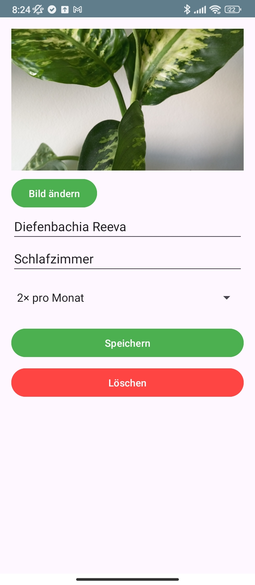
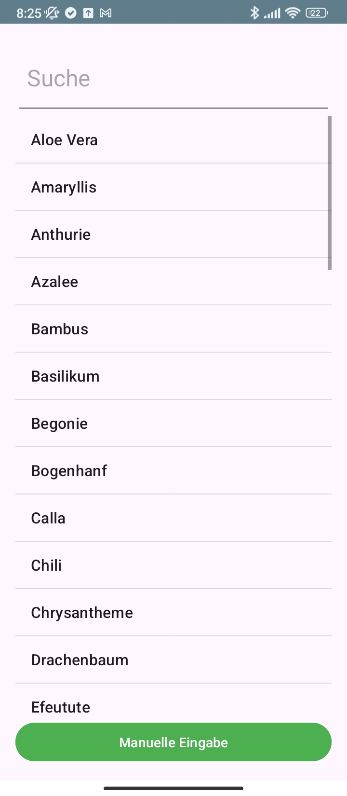
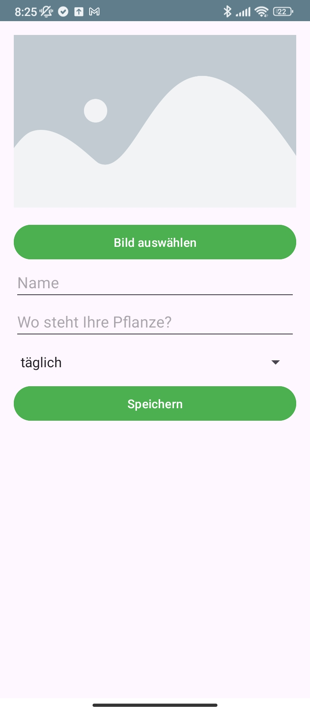

# 🌱 Plantify

**Plantify** is an Android application for managing and tracking the care of your indoor plants. Easily add plants, keep track of watering schedules, and get helpful facts to support plant care routines.

---

## Features

- **Add and manage plants** manually or through a searchable list
- **Track watering frequency** (daily, weekly, monthly, etc.)
- **Attach plant photos** from gallery or camera
- **Suggestions** with predefined plant data
- **Visual reminders** for when a plant needs watering
- **Fun facts of the day** from a curated collection
- **Delete and update entries**, including associated image cleanup
- **Offline-first**: all data is stored locally using JSON-based persistence


## Technologies Used

- Java
- Android SDK
- AndroidX libraries
- Gson (for JSON parsing)
- FileProvider
- ConstraintLayout
- Material UI

## Project Structure

- `activities/` – Contains all the Android activities (e.g., `MainActivity`, `ManualEntryActivity`, `PlantDetailActivity`).
- `adapters/` – RecyclerView adapters used for displaying plant data.
- `helpers/` – Utility/helper classes (e.g., for file handling).
- `interfaces/` – Interfaces for callbacks and communication between components.
- `models/` – Data models like `Plant` and `SearchPlant`.
- `persistance/` – Logic for saving and loading data (e.g., from JSON or internal storage).
- `assets/` – Contains static data files like `facts.json` and `search_plants.json`.
- `res/drawable/` – Image resources such as icons and placeholders.
- `res/layout/` – XML layout files for each activity and item view.

## Screenshots






## Setup

1. Clone the repository:
   ```bash
   git clone https://github.com/reacthjkl/Plantify.git

Open the project in Android Studio

Build & Run on an emulator or device (API 26+ recommended)

## Future

- Plants grouped by location (e.g., sleeping room, bath, kitchen, balcony, garden).
- Weather integration to check rainfall and notify if garden plants were already watered by rain.
- Add notifications to remind users to water their plants.
- Localization (multi-language support).

